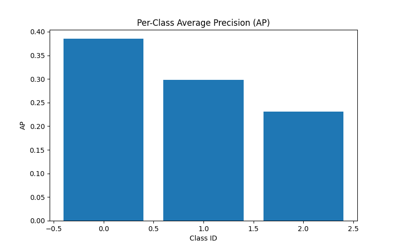

# 2D Object Detection using the Waymo Open Perception Dataset

This project focuses on building a machine learning model that can detect and classify objects (vehicles, pedestrians, and cyclists) in camera images from self-driving cars. It uses real-world driving footage from the Waymo Open Dataset to train a computer to draw boxes around these objects and identify what they are. The goal is to help improve the perception systems used in autonomous driving technology.

An example notebook can be found under [notebooks](notebooks) - which goes into detail around how this model was trained and evaluated using a subset of the Waymo data.

## DATA
The project uses the **Waymo Open Dataset (Perception)**, which includes millions of frames from autonomous vehicle sensors.
The labels focus on three object classes: **vehicles**, **pedestrians**, and **cyclists**. Data was pre-processed into PyTorch `.pt` files, and subsets were sampled for training, validation, and testing.  
**Citation:** [Waymo Open Dataset](https://waymo.com/open/)

## MODEL 
The model architecture is **Faster R-CNN** from the PyTorch `torchvision` library, selected for its strong performance on object detection benchmarks and out-of-the-box support for fine-tuning. It supports multiple object classes and bounding box regression, making it ideal for 2D perception tasks.

## HYPERPARAMETER OPTIMSATION
Hyperparameters such as learning rate, momentum, weight decay, and batch size were optimised using **Optuna**, an automated hyperparameter search framework. The objective function was based on **mAP@0.5** on a validation set.  
Experiments were run on a GCP L4 GPU VM, with training data subsets sampled locally to improve speed and stability.

## RESULTS
### Evaluation Summary

On the final test set, the model achieved an overall **mean Average Precision (mAP)** of **0.3047**, with an mAP of **0.5129** at IoU ≥ 0.50 and **0.3142** at IoU ≥ 0.75. Performance was strongest on **large objects** (mAP: 0.5829), while **small objects remained challenging** (mAP: 0.0564).

The **mean Average Recall (mAR)** with up to 100 detections per image was **0.3959**, again skewed toward better performance on large objects (mAR_large: 0.6822) compared to small (mAR_small: 0.1212).

Per-class mAP scores were:
- **Class 1 (Vehicles)**: 0.3848  
- **Class 2 (Pedestrians)**: 0.2978  
- **Class 3 (Cyclists)**: 0.2314  

These results indicate the model performs reliably on medium to large objects and is best suited to detecting Class 1 (Vehicles). However, improvements are needed in detecting small objects and boosting performance across lower-scoring classes.

To improve these scores, a few things could be done:
1. Train on a much larger dataset - only a subset was used
2. Run more hyperparameter tests to have greater confidence in the hyperparameters chosen for the final training
3. Create class-balanced datasets, which may impact the accuracy of some classes, but improve the accuracy of under-represented classes

 
### On Accuracy and Safety

Accuracy metrics like mAP and mAR are critical for evaluating perception models in autonomous vehicles, as they directly reflect the system's ability to reliably detect and localize objects in the environment. High accuracy across **all classes** is essential: a model that performs well on vehicles but poorly on pedestrians or cyclists may lead to unsafe decisions in complex driving scenarios. Ensuring balanced and robust detection performance helps reduce the risk of false negatives or misclassifications, which are especially dangerous when vulnerable road users are involved. In safety-critical applications like autonomous driving, even small improvements in detection accuracy can have a significant impact on real-world safety outcomes.

## VISUALISATION

A visualisation of the model making predictions on a video can be viewed at [assets/predictions.mp4](assets/predictions.mp4).